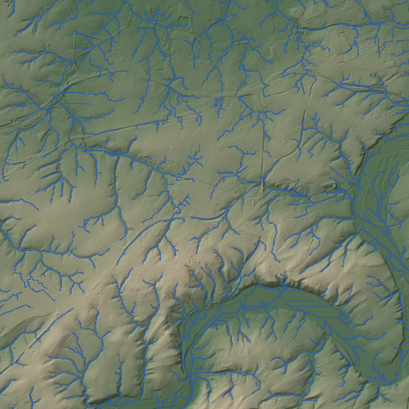

# GeoNeural

At the same complete storage cost, can a learned predictor, geological context or a landscape-process prior
store real terrain better than strong conventional codecs, and keep its drainage network?

GeoNeural answers with real files. Every compared product is a `.gnc` file that decodes on its own, its bytes
are its length, and every node is checked against the error bound. The terrain is NRW DGM1 at 10 m (Geobasis
NRW): six development regions of 10.24 km and seven confirmation regions chosen by a committed rule before they
were downloaded. The hypotheses, comparison rules and thresholds were frozen before the confirmation run
([protocol](docs/protocol-v2.md)).



*One development region: DGM1 at 10 m, hillshaded, with D8 streams (contributing area of at least 0.05 km2).*

## Results so far

The study is paused part way; [docs/results.md](docs/results.md) states the evidence level of each result.

* **Fewer bytes, confirmed.** A multilevel error-bounded coder with a small shared learned predictor (3.7 kB of
  weights, embedded in every file) is on average 17 to 26% smaller than the best conventional product at 0.05 to
  0.5 m maximum error, and smaller in every one of the seven untouched regions (14 to 27% per region). The best
  conventional product is the smallest of SZ3, the best of 14 SZ3 configurations, SPERR, zfp, LERC and q32. The
  same coder with a fixed cubic predictor is already 7 to 13% smaller; the learned part adds 11 to 15%.
* **The frozen drainage condition fails.** At the same maximum error the learned coder has a higher RMSE, and
  the best conventional product keeps more stream cells in some regions at every bound and in all regions at
  0.5 m, so the hypothesis as frozen (fewer bytes and no loss of drainage) is not supported.
* **Bytes are bought with time.** The learned decoder needs about 0.7 s per 1025 x 1025 field as WebAssembly and
  1.2 s in Python, against 0.01 s for SZ3. A Rust decoder reproduces the Python decoder bit for bit.
* **Allocating precision to drainage did not help.** Tightening the bound near decoded streams or on gentle
  slopes never improved the stream overlap by the required margin at equal bytes.
* **Geology carries a little information and does not pay for itself** (prototype): the GK100 map saves about 1%
  of the terrain stream and costs more to store.
* **Physics.** A bounded symmetric conductance closure keeps flat terrain exactly still and has the lowest
  rollout error of the learned closures. Rate and age cannot be told apart from one surface or from fractional
  epochs; a fixed timestep cap creates false information about them; two dated surveys can resolve them for a
  landscape that is still changing.

## What is here

| Path | Contents |
|---|---|
| `src/geoneural/codecs` | The `.gnc` container, rANS coder, multilevel coder with fixed and learned predictors, campaigns, conventional codecs |
| `src/geoneural/evaluation` | Experiment records and region-level statistics |
| `src/geoneural/metrics` | Drainage routing, stream metrics with tolerance and noise floor, sparse corrections |
| `src/geoneural/data` | Bounded downloads from the NRW services, the reference lattice, geology, the confirmation cohort rule |
| `src/geoneural/physics` | Landscape teacher and audit, learned closures, emulators, synthetic terrain, inverse and identifiability studies |
| `src/geoneural/recon`, `superres` | Reconstruction from coarse, missing or sparse observations |
| `src/geoneural/neural` | The v1 coordinate networks, latent grids and hybrids |
| `native/gnc` | Rust and WebAssembly decoder for `.gnc` products |
| `native/landscape-*` | Rust kernel of the browser physics lab |
| `web/` | Terrain viewer, physics lab, compression views with live WebAssembly decoding |
| `results/v2/` | Reports, the frozen models, the cohort record; `results/` also keeps the v1 reports |
| `docs/` | [Question](docs/scientific-question.md), [protocol](docs/protocol-v2.md), [methods](docs/methods.md), [results](docs/results.md), [data](docs/data.md), v1 [methods](docs/methods-v1.md) and [results](docs/results-v1.md) |

## Quick start

Python 3.12 and [uv](https://docs.astral.sh/uv/):

```bash
uv sync --extra codecs --extra fast
uv run pytest -q
uv run geoneural reproduce
```

`reproduce` rebuilds the Essen reference from the shipped tiles, checks its SHA-256 and reruns the v1 codec,
drainage and correction checks against `data/sample/essen-ruhr/expected.json`.

Encode and decode a product with the frozen model:

```bash
uv run geoneural encode --atlas .data/atlases/essen-ruhr --bound 0.25 --coder learned --model results/v2/frozen/final-s0.gnm --out essen.gnc
uv run geoneural decode essen.gnc --out essen.npy
```

The campaigns (`geoneural codec-h1`, `codec-h2`, `codec-h3`, `codec-h4`, `codec-paged`, `codec-confirm-h1`) need
PyTorch and a GPU (`uv sync --all-extras`); downloads and reports go to `GEONEURAL_HOME` (default `./.data`). Other
regions are fetched from the provider with `geoneural fetch --preset <region>` and `geoneural prepare --preset
<region>`.

## Browser views

```bash
uv run geoneural export-web
uv run geoneural codec-web-bundle --regions essen-ruhr muensterland-plain --bounds 0.1 0.5
cd web && npm install && npm run wasm && npm run dev
```

The page shows the terrain viewer, the physics lab, and two compression views: a side-by-side comparison of
products at one bound, with the learned product decoded live in a Web Worker, and where the bytes of a product go.

## Data and licenses

Code: MIT. Terrain: DGM1, Geobasis NRW, DL-DE-Zero-2.0. Geology: IS GK100, Geologischer Dienst NRW,
DL-DE-BY-2.0. Details, attribution text and what is not redistributed: [DATA_LICENSES.md](DATA_LICENSES.md).

## Limitations

* Thirteen regions of one German state, all at 10 m. Several confirmation tiles are neighbours on the 11 km
  candidate lattice, so they are not fully independent.
* The drainage measure compares the routing of two surfaces; it is not a hydrological model.
* Timings come from a shared workstation and are unqualified.
* The physics experiments are synthetic: a known teacher on generated surfaces. The teacher's own numerical error
  at the default step exceeds the budget the protocol sets for inverse work.
* The geology, process-prior, inverse-coverage and reconstruction studies were stopped before they finished.
