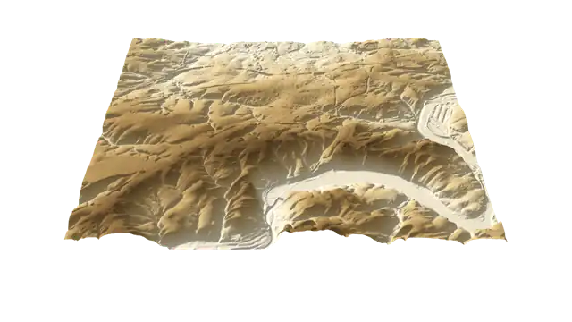
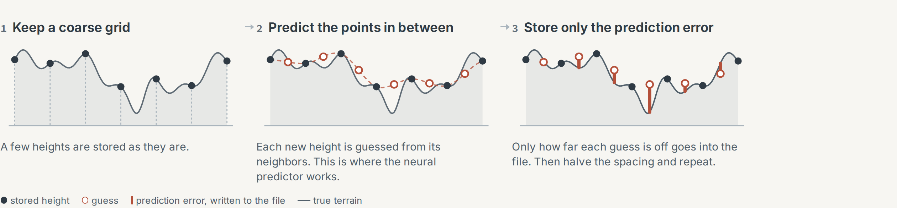
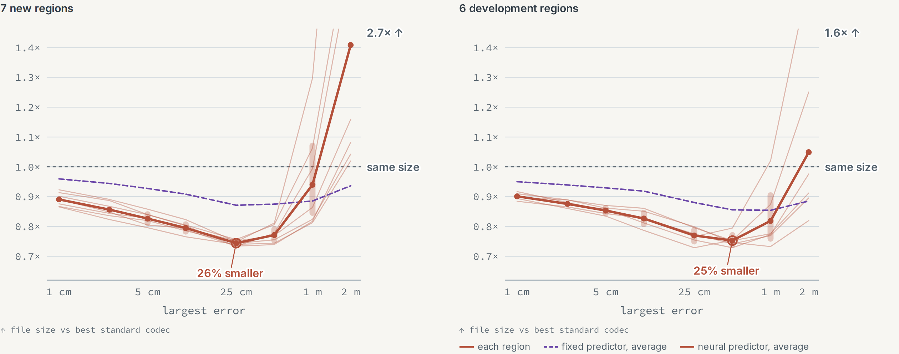
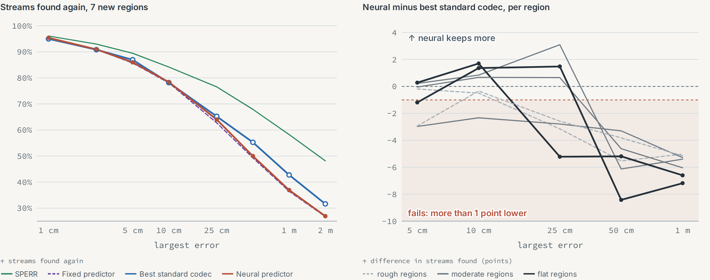
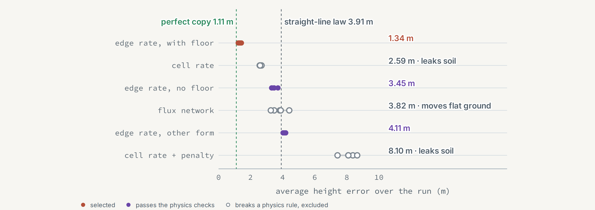
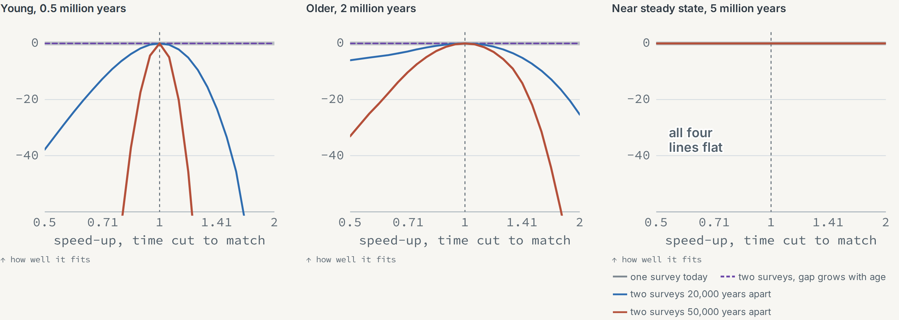

<p align="center">
  
</p>

# GeoNeural

Neural terrain compression, tested fairly against strong codecs, and the landscape physics behind its errors.

[Case study](https://rnle.github.io/profile/projects/geo-neural/) · [Results](docs/results.md) ·
[Methods](docs/methods.md) · [Protocol](docs/protocol-v2.md)

Elevation models from airborne laser scanning and satellites are among the largest maps there are: the 1 m
terrain model of North Rhine-Westphalia alone holds about 34 billion heights. GeoNeural asks two questions:

1. Can a small neural network store terrain in **fewer bytes** than the best standard codecs, with every height
   still within a fixed error?
2. Does the smaller file still **send water the same way**?

The data are 10 m tiles of NRW's DGM1: six development regions, and seven confirmation regions picked by a
committed rule before they were downloaded. Every compared product is a `.gnc` file that decodes on its own, and
its size is its length, model included. Hypotheses, comparisons and pass marks were fixed in advance
([protocol](docs/protocol-v2.md)).

## How the coder works

<p align="center"></p>

Like SZ3's interpolation mode, the coder keeps a coarse grid and fills in the levels between, predicting each new
height from its neighbors on a 1 mm lattice. Only the prediction error is written, with rANS. The neural predictor
(3.7 kB, stored inside every file) refines each guess and its spread, so the errors pack tighter. A Rust decoder,
also compiled to WebAssembly, reproduces the Python decoder bit for bit.

## Results

| Question | Evidence | Outcome |
|---|---|---|
| Fewer bytes than the best standard codec, and the same streams (H1) | confirmed, 7 new regions | bytes: yes; streams: no |
| A geological map helps (H2) | first test | a little, costs more than it saves |
| Extra precision near streams keeps them (H3) | development | no |
| Pretraining on simulated landscapes helps (H4) | in progress | no result yet |
| A structured learned closure stays accurate (H5) | development, simulation | yes |
| Rate and age can be inferred from the terrain (H6) | development, simulation | only with two dated surveys |

### Fewer bytes on regions the coder had never seen

<p align="center"></p>

At the same largest error, the neural files are **17 to 26% smaller** on average than the best standard codec
from 5 to 50 cm (14 to 27% per region), in every new region. The best standard codec is the smallest of SZ3 (its
default and the best of 14 settings), SPERR, zfp, LERC and q32. The fixed cubic predictor alone saves 7 to 13%;
the network adds 11 to 15%. At 1 m the gain shrinks to 6% and is not universal. The price is time: about 0.7 s
per 1025 x 1025 field in a browser, against 0.01 s for SZ3.

### The smaller files keep fewer streams

<p align="center"></p>

The same D8 routing runs on the original and on every decoded surface. The protocol allowed the neural file to
find at most 1 percentage point fewer stream cells than the best standard codec, in every region; the worst region
was 2 to 8 points lower, so H1 as frozen is **not supported**. The cause is the coder, not the network: at coarse
errors it spreads the error more evenly (at 50 cm its RMSE is 20 to 32% higher), and the fixed predictor loses as
many streams. Spending more precision near streams did not help at equal bytes.

### Landscape physics

<p align="center"></p>

A small network replaces the hillslope-creep step of a landscape-evolution simulation. The design that keeps flat
ground flat and conserves material by construction, a bounded symmetric conductance with a floor, has the lowest
rollout error (1.34 m over five seeds, against 1.11 m for the simulation at its own coarse step).

<p align="center"></p>

Scaling every rate by c and time by 1/c leaves the final surface unchanged, so one survey cannot tell a fast young
landscape from a slow old one. A fixed time-step cap hides this and invents information; two surveys a fixed
number of years apart resolve it while the landscape still changes. With correlated survey noise, the matching
likelihood gave honest 95% intervals in a first test (95 to 97% coverage, against 37 to 50% when the noise is
treated as independent).

### In progress

* **Geology:** the GK100 map as an extra input saved up to 1.5% of the coded terrain in a first test, more than
  shifted or blank controls, but storing the map costs more. The full study is running.
* **Reconstruction:** a U-Net turning 40 m averages into 10 m heights had a 16 to 19% lower mean error than the
  best non-neural baseline in a first test.
* **Next:** a coder that keeps the typical error low at the same limit, then the full geology, physics and
  reconstruction studies.

Every number above, with its evidence level, is in [docs/results.md](docs/results.md) and the reports under
[`results/v2/`](results/v2/).

## Repository

| Path | Contents |
|---|---|
| `src/geoneural/codecs` | `.gnc` container, rANS, multilevel coder with fixed and learned predictors, campaigns |
| `src/geoneural/metrics` | Flow routing, stream metrics, sparse corrections |
| `src/geoneural/data` | Bounded downloads from the NRW services, geology, the confirmation cohort rule |
| `src/geoneural/physics` | Landscape teacher, learned closures, inverse and identifiability studies |
| `src/geoneural/recon`, `superres` | Reconstruction from coarse or incomplete observations |
| `native/` | Rust decoder for `.gnc` products and the landscape kernel, both also as WebAssembly |
| `web/` | Terrain viewer, physics lab and live decoding in the browser |
| `results/v2/` | Reports, frozen models and the cohort record |

## Quick start

Python 3.12 and [uv](https://docs.astral.sh/uv/):

```bash
uv sync --extra codecs --extra fast
uv run pytest -q
uv run geoneural reproduce
```

Encode and decode a product with a frozen model:

```bash
uv run geoneural encode --atlas .data/atlases/essen-ruhr --bound 0.25 --coder learned --model results/v2/frozen/final-s0.gnm --out essen.gnc
uv run geoneural decode essen.gnc --out essen.npy
```

The campaigns (`codec-h1` to `codec-h4`, `codec-paged`, `codec-confirm-h1`) need PyTorch and a GPU
(`uv sync --all-extras`). Data and reports go to `GEONEURAL_HOME` (default `./.data`); regions are fetched with
`geoneural fetch --preset <region>` and prepared with `geoneural prepare --preset <region>`.

## Data and license

Code under the MIT license. Terrain: DGM1, Geobasis NRW, DL-DE-Zero-2.0. Geology: IS GK100, Geologischer Dienst
NRW, DL-DE-BY-2.0. Attribution and what is not redistributed: [DATA_LICENSES.md](DATA_LICENSES.md).

Limits: thirteen regions of one German state at 10 m, some of them neighbors; the stream measure compares
surfaces and does not model water; the physics runs on simulated landscapes; timings come from a shared
workstation.
