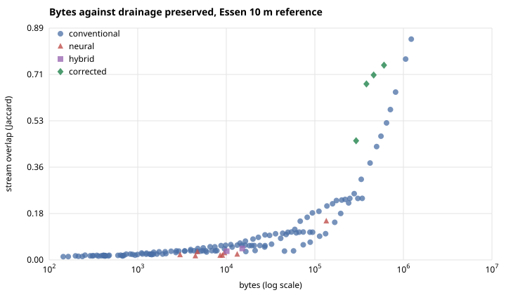
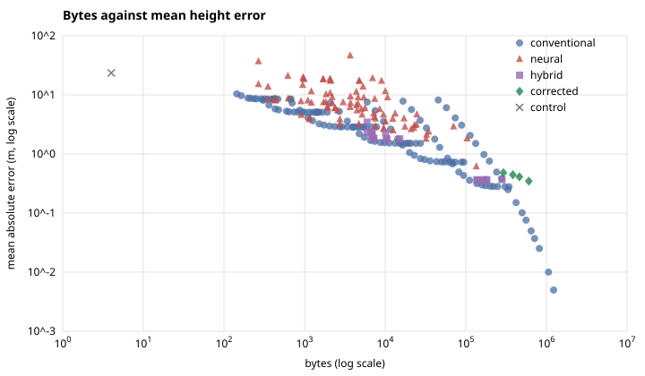

# Results (v1)

> **Historical (v1).** Kept for continuity. These experiments compared neural fields against a q32 codec that needs 2 to 4 times the bytes of SZ3, charged weights without the full decoder state, and scored some conventional products from a different decode than the one charged. The v2 study in [methods.md](methods.md) and [results.md](results.md) replaces their comparisons; the drainage and physics findings here are revisited there.

All numbers are for the Essen reference (1025 x 1025 nodes at 10 m) unless stated, and come
from the published reports in `results/`: `summary.json`, `candidates.json` and the reports in
`reproduced/`. Evidence labels:

* **reproduced**: rerun by this package from the prepared reference, report in `results/reproduced/`;
* **earlier run**: an earlier run of the same code whose report was kept but not rerun here.

## 1. Conventional codecs

All five pyramid levels (341 pages, 1,440,725 samples) were encoded by eight error-bounded codecs
at five maximum-error targets, plus four lossless controls. Every bounded codec met its bound on
every page. *(reproduced)*

| Codec | Payload at 0.1 m | Payload at 1 m | MAE at 1 m |
|---|---:|---:|---:|
| EAT1 (int32 codes, gzip) | 1,487,124 B | 441,349 B | 0.494 m |
| q32-delta-zstd | 931,219 B | 361,951 B | 0.494 m |
| SZ3, absolute error | 687,749 B | 237,851 B | 0.321 m |
| zfp, fixed accuracy | 1,541,528 B | 816,760 B | 0.061 m |
| LERC (GeoTIFF, zstd) | 1,360,613 B | 723,746 B | 0.483 m |
| Wavelet bior4.4 + zstd | 1,230,654 B | 439,288 B | 0.181 m |

Lossless float32 needs 3.72 to 4.07 MB. SZ3 is the smallest at every target; q32-delta-zstd is the
simplest bounded codec that a browser can decode without a native library. The JSON
page index (220,815 B) is 38 % of the q32-delta-zstd package and 48 % of the SZ3 package at 1 m,
so at low rates the index becomes a large share of the cost.

## 2. Height error is not drainage

The same routing on reference and reconstruction (D8, 500-cell streams). *(reproduced)*

| Max error target | MAE | Stream overlap (Jaccard) | Stream recall | Basins (reference 268) |
|---|---:|---:|---:|---:|
| 0.01 m | 0.005 m | 0.849 | 0.918 | 356 |
| 0.05 m | 0.025 m | 0.646 | 0.784 | 617 |
| 0.1 m | 0.050 m | 0.528 | 0.688 | 895 |
| 0.5 m | 0.249 m | 0.311 | 0.465 | 2,128 |
| 1 m | 0.494 m | 0.219 | 0.349 | 2,798 |

At a 1 m bound, which most users would call accurate for a 10 m model, about two in three
reference stream cells are lost or moved (recall 0.35) and the basins fragment tenfold. Flat ground decides it: at a 5 cm
bound, 59 % of flow directions survive on slopes under 0.5 %, against 98 % on slopes over 15 %.

## 3. Sparse corrections buy drainage back

The encoder stores the 1 m quantiser plus exact values on a band around the reference streams.
*(reproduced)*

| Product | Bytes | MAE | Stream overlap at 500 cells | at 250 / 1,000 / 2,000 cells |
|---|---:|---:|---:|---:|
| 1 m bound alone | 241,060 | 0.494 m | 0.219 | 0.208 / 0.216 / 0.205 |
| + corrections, band radius 0 | 292,397 | 0.481 m | 0.458 | 0.383 / 0.461 / 0.477 |
| + corrections, band radius 1 | 382,671 | 0.445 m | 0.677 | 0.534 / 0.683 / 0.672 |
| + corrections, band radius 2 | 461,688 | 0.411 m | 0.711 | 0.562 / 0.720 / 0.727 |
| + corrections, band radius 4 | 604,025 | 0.347 m | 0.749 | 0.609 / 0.774 / 0.782 |
| 0.5 m bound, no corrections | 333,880 | 0.249 m | 0.311 | 0.292 / 0.313 / 0.303 |

Every product keeps a 1 m maximum error. With a band reaching one cell either side of the
streams, 141,611 B of corrections triple the stream overlap. The best uniform bound that fits in the same size reaches 0.31; uniform
precision reaches 0.68 somewhere between the 0.05 m bound (817,032 B, 0.645) and the 0.02 m bound
(1,060,321 B, 0.772), that is at 2.1 to 2.8 times the bytes.

The band is chosen at the 500-cell threshold, so the method is also scored at other thresholds.
The gain holds at all of them; it is smallest at 250 cells, where many streams are not protected.

## 4. Neural fields against a dense conventional envelope

Learned rows: 103, all scored on the same reference as codecs (every node encoded): 12
search finalists at seven storage widths (float16, and 8, 6 and 4 bit, after training or with
quantisation-aware training), nine codec fits in float32 and float16, and one saved SIREN. The
conventional side has 133 rows (grids of 10 to 640 m, each at 19 error targets) plus a stored
field mean. *(reproduced)*

* **Joint dominance.** With one comparator row on bytes, mean error and maximum error, most learned
  rows are dominated. Nine are not:

  | Learned row | Bytes | MAE | Max | Best conventional at no more bytes | Mean error | Max error |
  |---|---:|---:|---:|---|---:|---:|
  | hybrid-t0, 6 bit | 166,930 | 0.355 m | 8.95 m | 20 m grid at 0.2 m (158,633 B) | 19 % worse | 0.09 m better |
  | hybrid-t0, 4 bit | 137,972 | 0.356 m | 8.94 m | 20 m grid at 0.3 m (136,918 B) | 13 % worse | 0.10 m better |
  | hybrid-t5, float16 | 10,404 | 1.80 m | 19.0 m | 80 m grid at 0.75 m (9,822 B) | 15 % worse | 1.9 m better |
  | hybrid-t5, 8 bit (two) | 7,210 to 7,215 | 1.82 to 1.84 m | 19.4 to 19.5 m | 80 m grid at 2 m (6,569 B) | 8 to 9 % worse | 2.7 to 2.8 m better |
  | siren-t17 codec fit, float16 | 2,742 | 3.21 m | 26.5 m | 160 m grid at 1 m (2,729 B) | 11 % worse | 2.4 m better |
  | siren-t42, 8 bit (two) | 1,141 to 1,147 | 3.85 to 4.09 m | 39 to 41 m | 160 m grid at 8 m (1,105 B) | 2 to 7 % better | 8 to 9 m worse |
  | siren-t42, 6 bit | 903 | 4.56 m | 45.6 m | 320 m grid at 1.5 m (824 B) | 11 % better | 3.5 m worse |

  Each trades one error measure against the other by a margin a different conventional point would
  erase. No learned row beats the best conventional point at its size by more than 11 % in mean
  error, and those that do are metres worse at their worst node.
* **Drainage.** Every learned row whose streams were measured (the nine codec fits and the
  saved SIREN) keeps fewer of them than the conventional point with the highest overlap at no more
  bytes, for example 0.030 against 0.040 at about 4 kB and 0.044 against 0.065 at about 15 kB.
* **The saved SIREN.** A SIREN with 128 x 3 units stored in float32 (134,788 B) reaches 0.613 m mean
  and 16.6 m maximum error with stream overlap 0.149. A 20 m grid at a 0.5 m bound costs 111,219 B
  for 0.358 m mean, 8.94 m maximum and overlap 0.187.
* **The smallest undominated hybrid.** hybrid-t0 with 4-bit weights (137,972 B) is its conventional base (the same
  20 m grid, 111,219 B, 0.358 m) plus 26,753 B of network that lowers the mean error by 2 mm.
  Spending those bytes on the base instead (136,918 B) gives 0.315 m, at 0.1 m more maximum error.

## 5. Physics: conservation built in against conservation asked for

Each arm predicts the rate of height change on 24 unseen surfaces; five seeds per arm, medians
with the range over seeds. *(reproduced)*

| Arm | Error in the rate (m/yr) | Relative conservation residual | Finite 64-step rollouts |
|---|---:|---:|---:|
| Face flux, conservative by construction | 0.0048 (0.0042 to 0.0051) | 8e-9 (5e-9 to 9e-9) | 5 of 5 |
| Diffusivity field, no penalty | 0.0059 (0.0058 to 0.0060) | 0.023 | 5 of 5 |
| Diffusivity field, penalty 0.0001 | 0.0061 | 0.027 | 5 of 5 |
| Diffusivity field, penalty 0.001 | 0.0071 | 0.027 | 5 of 5 |
| Diffusivity field, penalty 0.01 | 0.0104 | 0.0096 | 5 of 5 |
| Diffusivity field, penalty 0.1 to 10 | 0.0142 | 0.00011 to 0.00013 | 5 of 5 |
| Linear diffusion, teacher's coefficient | 0.0162 | 0 by construction | |

The flux arm is the most accurate learned update and its residual is float32 rounding, as the
construction guarantees for any weights. The penalty buys balance only by giving up accuracy: at
weights of 0.1 and above the network settles near linear diffusion and still sits about four orders
of magnitude above the flux arm's residual. An earlier single-seed run of the same experiment gave
0.0031 for the flux arm; training on the GPU is not bitwise repeatable for these convolutional
networks, which is why the comparison is reported over seeds.

The landscape-evolution model behind the emulator experiments (uplift, stream power, diffusion)
passes its own audit: timestep and grid refinement converge, the closed-domain balance closes, and
the slope-area exponent matches. The coarsest grid that still converges is 100 m. *(reproduced)*

## 6. Geology helps only a weak model

The GK100 surface lithology was given to the networks as an extra input in four setups, against
four controls with the same network: no context, the same map shifted out of registration, a
shuffled map and a generic map. Three seeds each; every seed trains every arm, so differences are paired.
Scored on held-out test pages. *(reproduced)*

| Setup | Held-out MAE with the real map | Real against misaligned, per seed | Real against no map |
|---|---:|---:|---:|
| FiLM, whole field | 4.76 to 5.30 m | +0.06, +0.26, -0.04 m | -0.26, +0.14, +0.32 m |
| Concatenated, whole field | 4.16 to 4.29 m | +0.41, +0.30, +0.36 m | +0.44, -0.06, +0.46 m |
| FiLM, correction to a 40 m grid | 1.21 to 1.22 m | -0.01, -0.00, -0.00 m | +0.00, -0.00, +0.00 m |
| Concatenated, correction | 1.20 to 1.23 m | +0.02, +0.01, -0.03 m | -0.01, +0.03, -0.01 m |

Positive means the real map lowered the error. The map costs 28.5 kB in every setup. Only the
concatenated whole-field network gains on every seed against the misaligned copy (7 to 9 %), and
the earlier run of the same code agrees in sign on every seed. That network's held-out error is
still above 4 m. Where the network corrects a conventional 40 m grid, which alone reaches 0.845 m
on the same pages, every arm makes the grid worse and the map has no measurable effect.

The earlier verdict that geology had no effect compared the spread of each arm across seeds; a
paired comparison finds the one consistent effect. A 1:100,000 map rasterised at 10 m carries
little that a terrain codec can use, and what it carries helps only a model that knows little.

## 7. Other experiments

All reproduced; each closes a question the main comparison raised.

* **Super-resolution, 10 m to 1 m.** The 10 m field is a declared area average of the 1 m reference,
  so every method can be checked against the operator. Trained on Essen, a local implicit network
  (LIIF, 1.02 MB) reaches 0.115 m mean error against 0.128 m for bicubic interpolation with
  back-projection on Essen, 0.097 m against 0.099 m on the Sauerland, and loses on the flat
  Münsterland (0.075 m against 0.070 m). EDSR behaves alike; a residual SIREN loses in both held-out
  regions. No method recovers
  the 1 m drainage: stream overlap stays between 0.02 and 0.06 for every method and region.
* **Landscape emulators.** A U-Net and a Fourier neural operator trained on 288 of 400 simulated
  landscapes and scored on 40 held-out ones beat persistence on height (FNO: 2.3 m against 4.5 m
  after one step, 4.5 m against 13.6 m after eight) but are worse than persistence on stream
  overlap at every rollout length (0.055 against 0.182 after one step) and miss the material balance by several times the uplift. Neither
  passes. The 400 simulations were regenerated bit for bit.
* **A fault as a coordinate transform.** On a synthetic block with one fault, a network that learns
  a warp of its coordinates predicts held-out boreholes better (4.07 m) than a plain network
  (5.90 m), but an oracle given the true fault does worst (8.12 m), so the gain cannot be credited
  to representing the fault.
* **A physics prior at equal bytes.** On the Rothaar-Sauerland region, feeding the network a
  landscape-model prior makes it 0.77 m worse than feeding it the same prior rotated and flipped,
  with a seed spread of 0.06 m. The prior
  does not help.
* **Decode latency.** Each of the 12 ladder finalists was timed against conventional page decoding on
  the same queries, back to back in alternating order. Median over the finalists, the networks are
  8.1, 9.2 and 10.7 times slower for 1, 289 and 4,225 points, where a page has to be read whole,
  and 1.9 and 2.6 times slower for 65,536 and one million points. At 65,536 points every network is
  slower by its own median (lowest 1.08), but in the earlier run one network (mlp-t38) was faster
  than the pages there (median 0.92), so "slower at every query size" does not hold in general.
  Decoding needs 0.36 to 2.9 GB of GPU memory. The run was not isolated from other work on the
  machine, so the timing is not qualified and only ratios are reported.

## 8. What did not hold up

Earlier runs of this code produced claims that did not survive a closer look. They were
withdrawn and are not repeated here:

* an early "first undisqualified" Fourier point, made against a conventional grid capped at 1 m,
  and a hybrid "50 % cheaper" result with the same defect;
* a hybrid win at 26.6 kB whose conventional base was not charged;
* a "best survivor" network at 268 B that was worse than storing the field mean;
* fronts labelled as an evolutionary search that were random search;
* super-resolution gains of 13 to 16 % that came from a missing back-projection step and edge
  contamination;
* a physics-prior gain that reversed sign at full training length;
* the assumption that all regions share one survey epoch (they span 2020-12 to 2025-02).

One summary claim is corrected here. An earlier verdict that "nothing survives on bytes, mean and
maximum error together" compared each network against two different conventional rows, one for the
mean and one for the maximum. With one comparator row and a dense sweep, a few learned rows are
formally undominated. The margins (section 4) do not change the conclusion.

## 9. Reproduction against the earlier runs

Every experiment above was rerun with this package and compared with the earlier run of the same
code.

| Experiment | Agreement with the earlier run |
|---|---|
| Reference array, rebuilt from the provider tiles | Identical SHA-256 |
| 341 pyramid pages | Identical after decompression; the gzip header differs in one byte between Python builds |
| Codec comparison, 8 bounded codecs at 5 targets and 4 lossless controls | Identical payloads; the JSON index is 19 B longer because its metadata strings changed |
| Drainage metric and sparse corrections | Identical |
| Neural codec fits (9 families) and quantised ladder (12 finalists, 7 widths) | Identical bytes and errors |
| Saved SIREN | Identical |
| Conventional comparison points of the ladder | Identical bytes, mean error within about 1e-7 m of the dense sweep |
| Registration checks, teacher audit, event field, distillation | Identical |
| Synthetic landscape ensemble, 400 simulations | Bit-identical |
| Flux closure, single seed | Same ranking; flux error 0.0047 against 0.0031 m/yr, because GPU training of these convolutions is not bitwise repeatable; hence five seeds |
| Geology ablations | Same bytes; gains vary between runs, see the paired analysis in section 6 |
| Landscape emulators | Same verdict; the U-Net differs between runs, as it did before |
| Super-resolution | Same ranking; this run scores 512 evaluation tiles instead of 256, so absolute errors shift by a few percent |
| Decode latency | Same shape; medians 10 to 25 % higher on a shared machine, ratios only |
